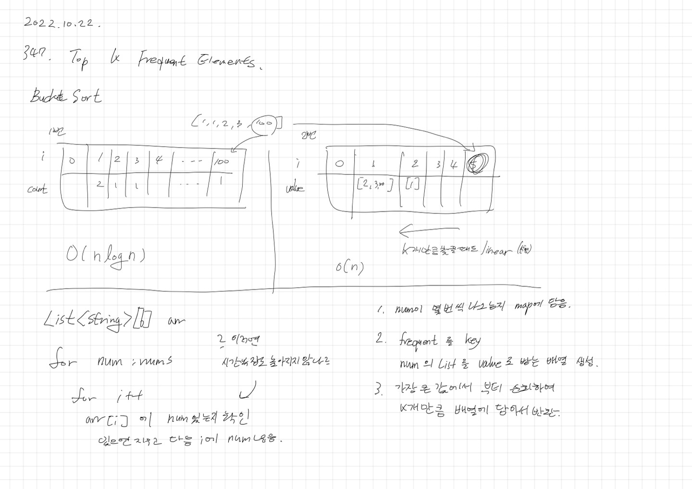

# 2022.10.22.

## 347. Top K Frequent Elements

[Top K Frequent Elements](https://leetcode.com/problems/top-k-frequent-elements/)



까도 까도 할게 나오네 이렇게 풀수도 있구나.. 싶다

참고 자료로 두기는 하는데 퀵셀렉션 까지는 하기에 오래 걸릴 것 같아 패스

## Bucket Sort

[버킷 정렬](https://ko.wikipedia.org/wiki/버킷_정렬)

배열의 원소를 버킷으로 분산해 정렬시키는 알고리즘

```
1. 빈 버킷의 배열을 준비한다.
2. 분산: 정렬할 배열의 원소를 각각 버킷에 넣는다.
3. 내용물이 있는 버킷을 각각 정렬한다.
4. 수집: 버킷을 순서대로 방문하며 모든 원소를 원래 배열에 다시 넣는다.
```

## Quick Select

[퀵 셀렉트](https://ko.wikipedia.org/wiki/퀵셀렉트)

