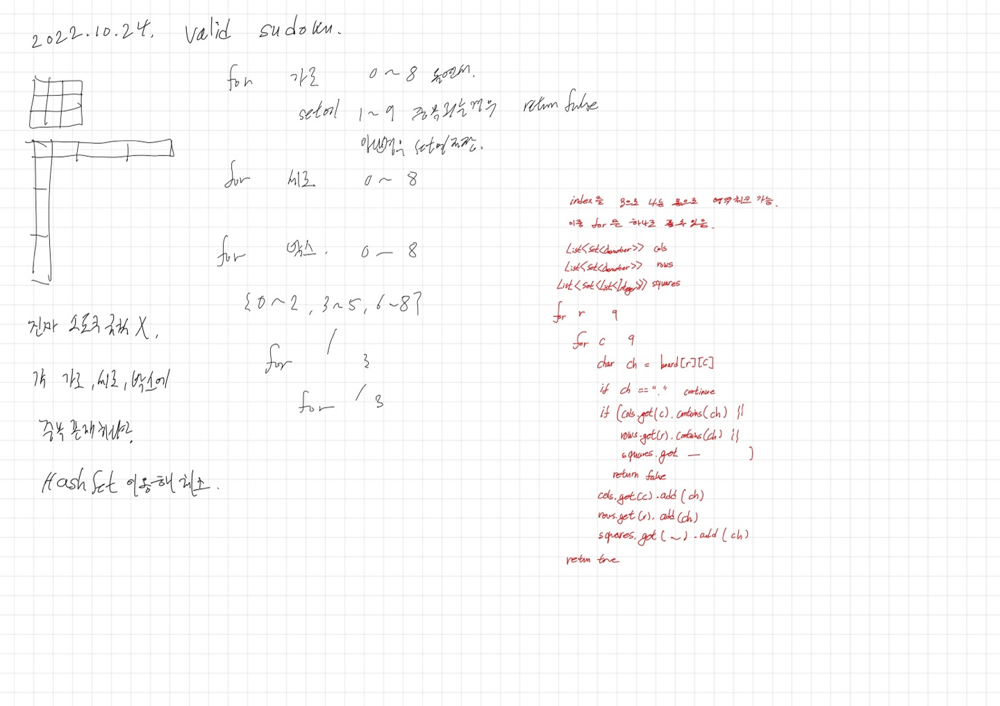

# 2022.10.24.

## 36.Valid Sudoku

[valid-sudoku](https://leetcode.com/problems/valid-sudoku/)

처음 풀이는 금방 풀고, 강의 들으면서,

python 으로 푸셔서 이중 for 문만 있으면 풀 수 있네,

Java 로 풀어봐야겠다 하고 풀다가 좀 걸렸다.

key 를 Set 으로 해서 생긴 문제였다.

List 로 바꾸고 해결했다.

Set, Map 에서 List, Map, Set 을 Key 로 사용할 수 있다.

메모리 주소 값이 달라도, 값이 같으면 같은 key 로 처리함.

전부터 애매 했는데 좀 정리 된 느낌이다.