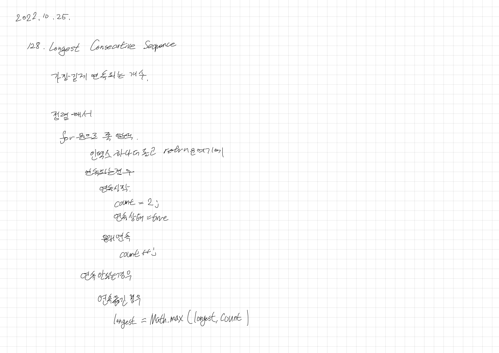

# 2022.10.25.

## Longest Consecutive Sequence

[128. Longest Consecutive Sequence](https://leetcode.com/problems/longest-consecutive-sequence)

이거 푸는데 40분이 넘게 걸렸다.

왜 오래 걸린건가 생각해 봐야겠다.

1. 일단 구현부터 하려 해서?

   -> 펜으로 정의는 안했었으나, 주석으로 정의해두고 짜서 이건 딱히 아닌듯

2. 엣지 케이스오류를 잡지 않아서?

   -> 이것 때문에 계속 값 돌려보기는 했음

3. 현재 과정에서 어떤 결과가 나와야 하나?

   -> 이게 불분명해서 계속 값을 바꾸고 테스트 해보고를 반복해 오래 걸렸던 것같다.

앞으로 문제를 풀 때 주석으로 해야할 것을 적고, 나와야하는 결과를 적어가며 풀어야겠음
