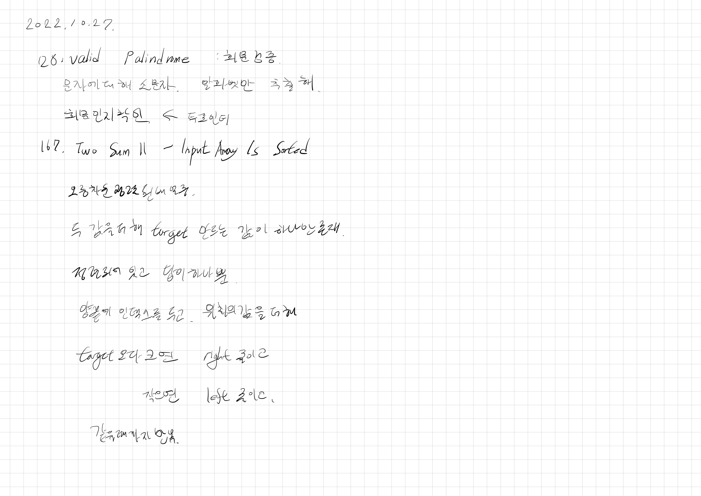

# 2022.10.27.

## Valid Palindrome

[Valid Palindrome](https://leetcode.com/problems/valid-palindrome/)

[정규 표현식](https://docs.oracle.com/javase/8/docs/api/java/util/regex/Pattern.html#sum) 참고해 풀이

## 167. Two Sum II - Input Array Is Sorted

[167. Two Sum II - Input Array Is Sorted](https://leetcode.com/problems/two-sum-ii-input-array-is-sorted/)

어디서 많이 본 문젠데... 뭔가 익숙한데 어디서 봤는지 기억이 안나네

아 찾아보니까 최근에 푼 릿코드 1번 이었다.

그때는 해시 이용해서 풀었었는데 이렇게도 풀수 있구만.

어려운 문제들이 아니라 프로그래머스를 다시 갈까 싶지만,

문제에 주어진 조건을 제대로 읽고 어떻게 구현해할지 생각하는 연습이 되고 있다.
