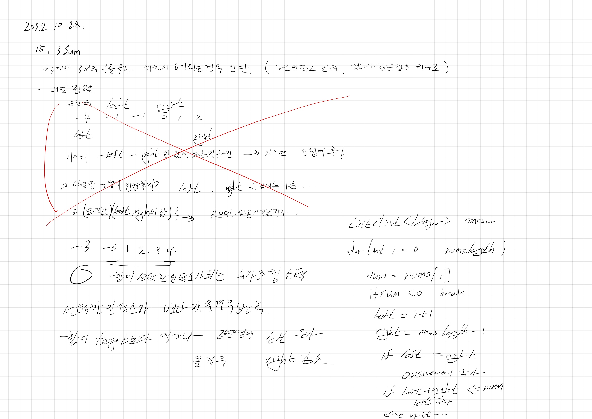

# 2022.10.28.

# 15. 3Sum

[15.3Sum](https://leetcode.com/problems/3sum)

투포인터 문제로, 일단 투 포인터로 두 개 잡고, 안에 있는 값에서 두 잡은 값의 합과 절대값이 같은 값을 찾으려 했다.

근데 그러면 포인터를 옮겨야할 상황이 언젠지를 구분할 수 없었다.

그래서 이건 아닌 것 같아 강의로 아이디어를 확인 했다.

하나의 값을 잡으면, 기존에 푼 2Sum 문제와 같은 문제가 됐다.

여기에 만족하는 값이 여러개 있을 수 있으니까 이를 고려한 조건까지 추가해주면 문제가 해결 됐다.

## 중복 제거

중복 제거를 어떻게 해야하나 하고 Set을 이용하려다가

Set -> List 로 바꾸는게 메모리도 들고 해서, 다른 방법이 있을 것 같아 고민, 생각 안나서 답 확인

인덱스를 바꿀 때 현재 인덱스와 다음 인덱스의 값이 같으면 각각 continue, ++, -- 하는 조건 추가 해주면 됨

