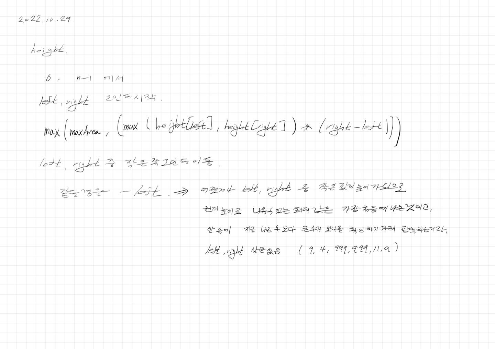

# 2022.10.29.

## Container With Most Water

[Container With Most Water](https://leetcode.com/problems/container-with-most-water/)

아침에 어떻게 문제를 해결할지 고민하고, 정리 해둔 후 나중에 그대로 코드로 옮겼다.

요즘 프로그래머에 대해 다시 생각해 보고 있다.

그건 회고에서 자세히 쓰고 간단하게 써보면

프로그래머는 결국 문제를 해결하는 사람인데

그 방법 중 하나로 코드를 이용하는 것 같다.
