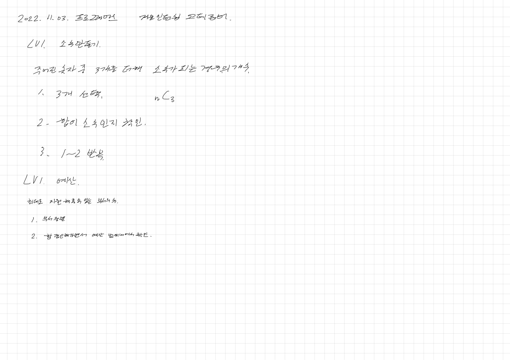
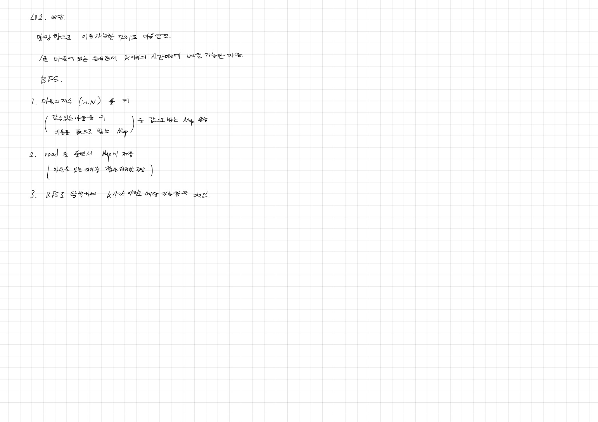
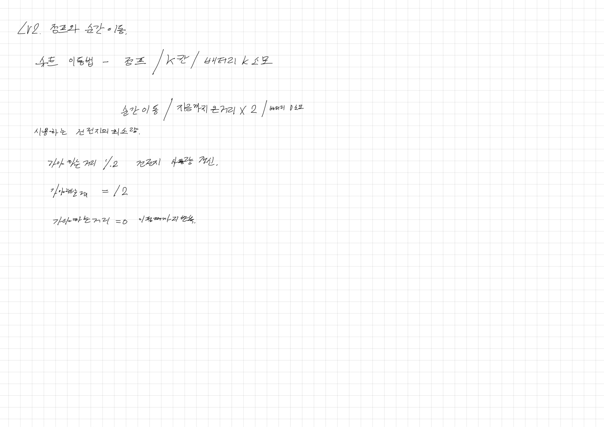
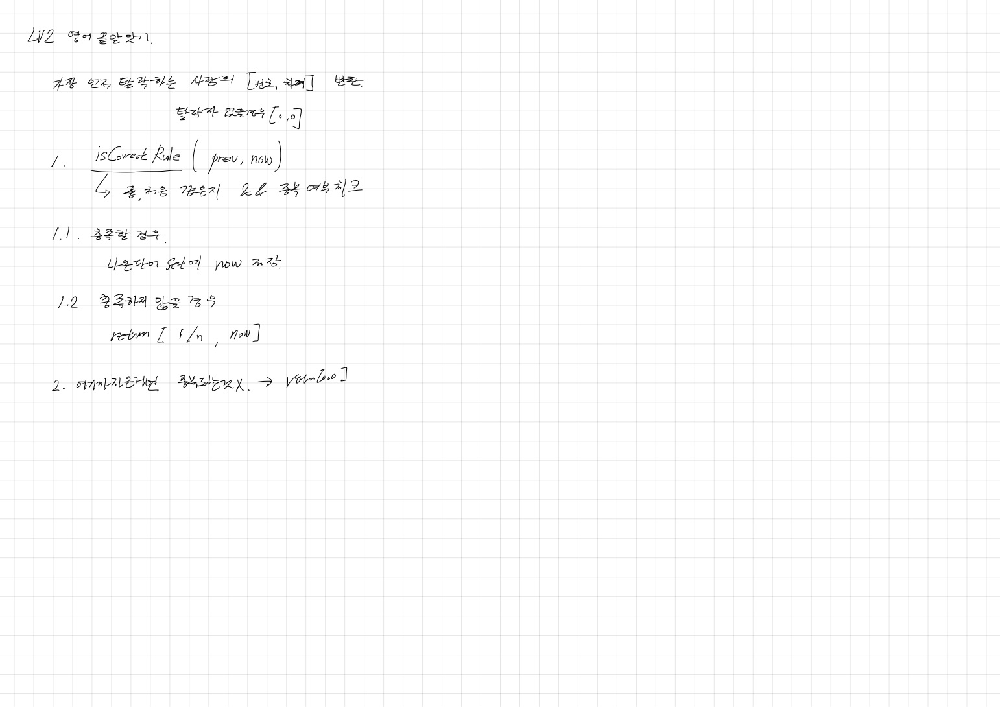
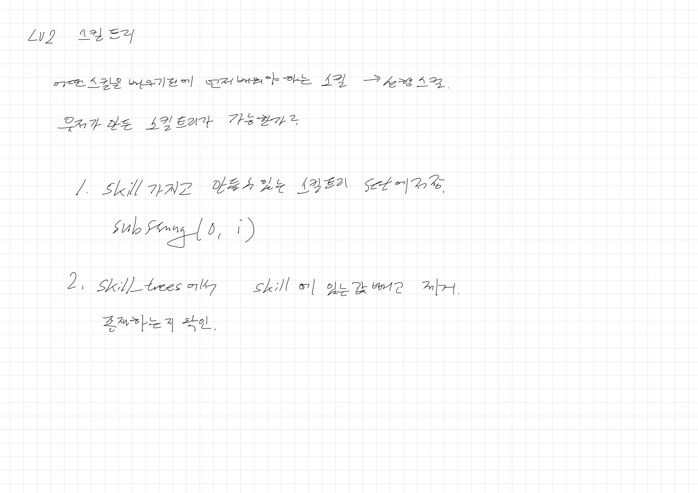
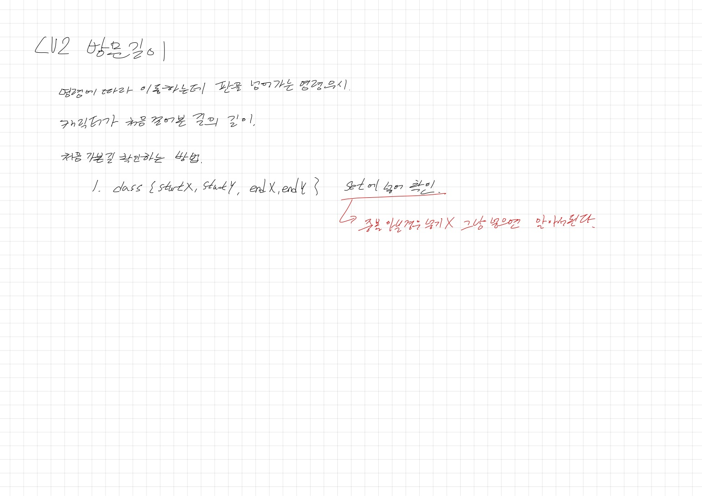
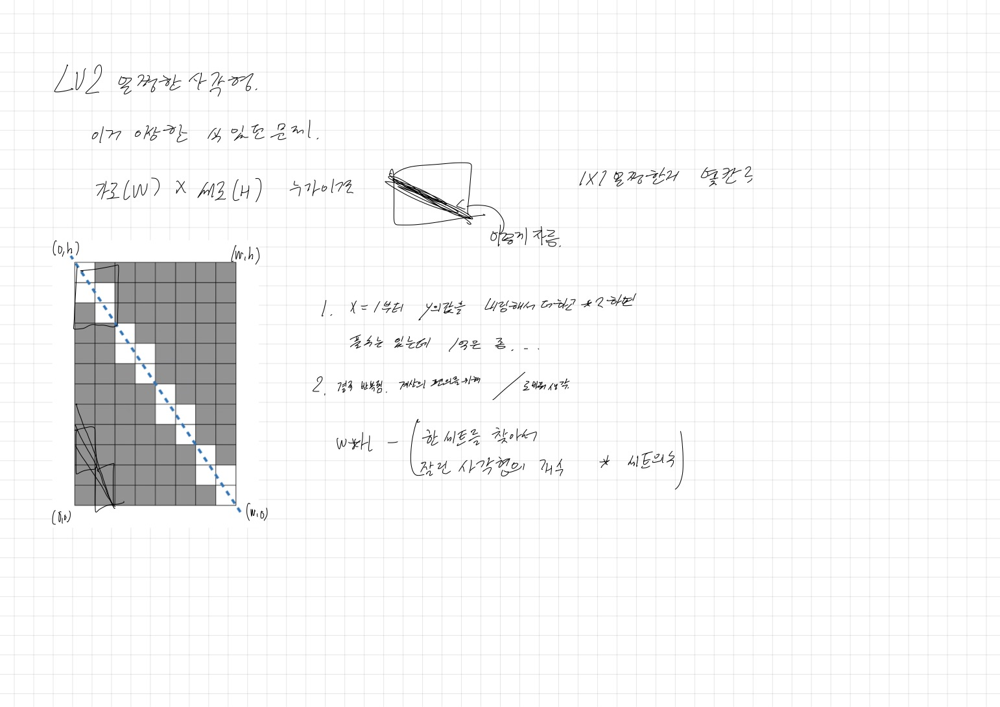

# 2022.11.03.

# Summer/Winter Coding 기출 풀이

[기출 문제](https://school.programmers.co.kr/learn/challenges?order=acceptance_asc&page=1&partIds=17615%2C6174)

# 아이디어 생각

## 1단계

## 2단계

# 구현

## 1단계

[소수 만들기](https://school.programmers.co.kr/learn/courses/30/lessons/12977)

조합을 만들어야 하나 하던 중 1단계는 이럴리 없다 싶어서 검색

그냥 3중 for 문으로 3개 선택해서 해결.

소수도 절반 아니고 제곱근까지만 구하면 된다는거 기억남