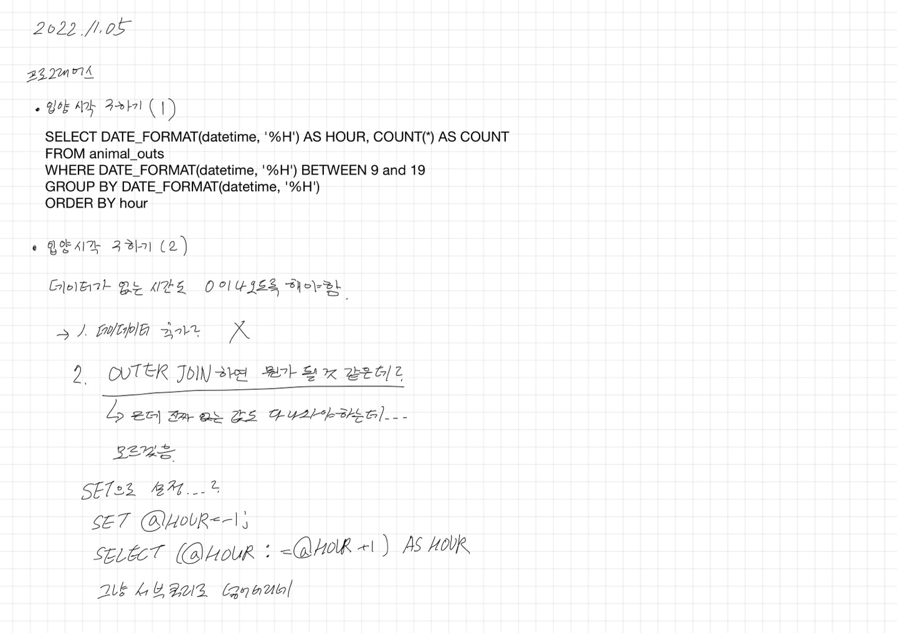
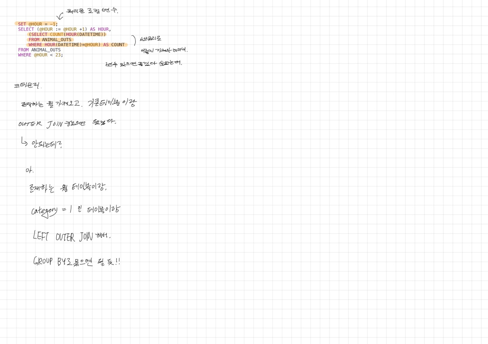

# 2022.11.05.

## 입양 시각 구하기





[입양 시각 구하기(1)](https://school.programmers.co.kr/learn/courses/30/lessons/59412)

[입양 시각 구하기(2)](https://school.programmers.co.kr/learn/courses/30/lessons/59413)

전부터 변수가 있었으면 좋겠다 싶었는데 이런 방법이 있었구나

[SET](https://three-pleasure.tistory.com/256) 이런게 있다.

* SET

```
선언
SET @변수이름 = 대입값;
SET @변수이름 := 대입값;

사용
SELECT @변수이름 := 대입값;
```

## 오늘 본 코테에서 못 푼 문제 풀이.

이 문제 풀면서 아이디어 얻고 아래 자료 참고해서 풀이 했음.

* https://lcs1245.tistory.com/entry/SQL-문자날짜-형-변환-TOCHAR-TODATE-DATEFORMAT-STRTODATE-CONVERT