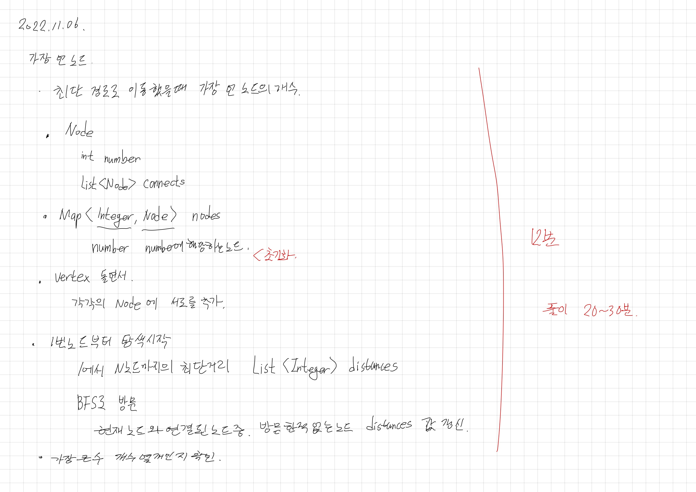

# 2022.11.06.

전에도 비슷한 유형을 풀었어서 그런지 정말 깔끔하게 풀렸다.

그래... 이런날도 있어야지...

# 가장 먼 노드

[가장 먼 노드](https://school.programmers.co.kr/learn/courses/30/lessons/49189)

처음엔 DP 카테고리에 들어온 줄 알고

아... distance 에 거리 저장 해두고 이전 연산 안 하니까 이게 DP 였나? 하고 풀었다.

근데 보니까 그래프 카테고리 였어서 머쓱했다.

아무튼.

처음엔 클래스를 만들고,

각 노드 클래스에 현재 위치에서 갈 수 있는 노드를 저장하고,

노드를 Map 에 담아서 번호에 해당하는 노드를 사용했다.

BFS 를 이용해 노드 간의 거리를 확인 했고

(순차적으로 탐색하므로 처음에 입력된 값이 최단 거리, DFS 로 했을 경우 값 비교를 하고 갱신 해주면 될 텐데.

이 경우에는 BFS 로 푸는게 중복 연산 덜하고 더 효율적이라 생각함.)

스트림 이용해서 간단하게 가장 먼 노드의 개수를 구했다.

그리고, 다른 사람들은 어떻게 풀었나 검색해보면서 이걸 그래프라고 하고 두 가지로 구현할 수 있구나 알았다.

## 참고할만한 자료

* https://born2bedeveloper.tistory.com/43
* https://born2bedeveloper.tistory.com/42

