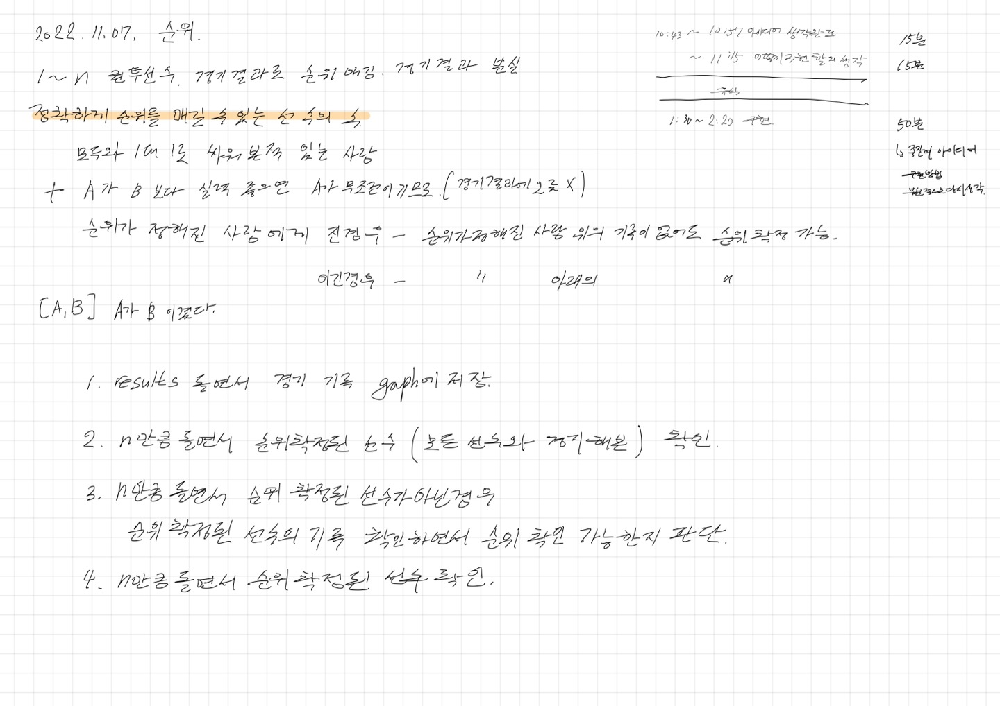

# 2022.11.07.

## 순위

[순위](https://school.programmers.co.kr/learn/courses/30/lessons/49191)

일단 1차로 풀이 완료.

밥먹고 졸면서 구현해서 좀 오래걸렸다.

큰 문제를 작은 문제로 나눠서 구현하니 그리 어렵지는 않았으나.

부분 부분 나누다 보니 비효율적으로 나눠진 부분도 있다고 느껴졌음.

일단 예상 보다 시간 오래 걸렸으니 다른 일 하러가야겠다.