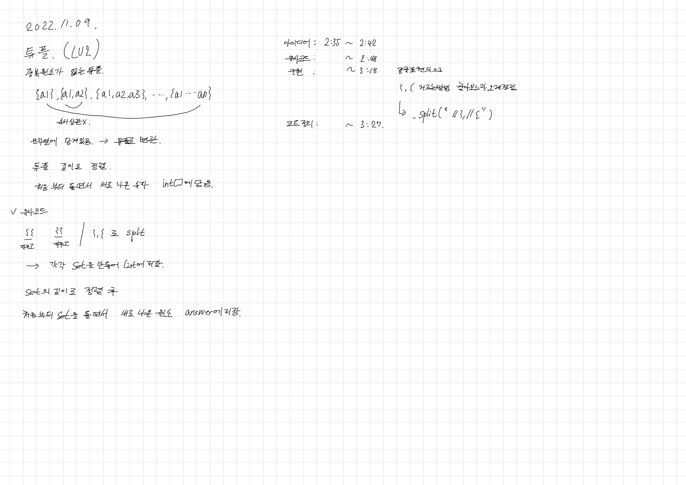
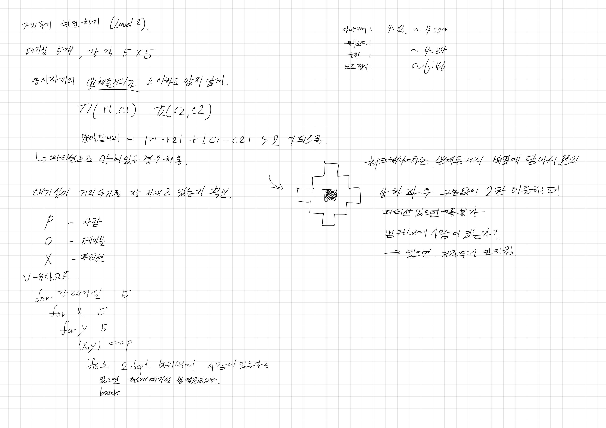

# 2022.11.09.

## 카카오 뱅크 인턴십 코테 준비

[기출 문제](https://school.programmers.co.kr/learn/challenges?order=acceptance_desc&page=1&languages=java&partIds=22586%2C18498%2C17931%2C31236)

난이도 : 12334 / 12345 / 12334 / 12334

## 준비 계획

4단계 이상은 패스하고, 2, 3단계 중점적으로 준비.

2단계 : 4문제

3단계 : 7문제

수 2단계 다 풀고

목, 금, 토 3단계 2문제씩 풀기

풀거 많으니까 한 문제에 집중 X

아이디어 생각, 정리, 구현 -> 한시간 정도로.

## 튜플 (Level2)



큰 어려움 없이 구현

## 거리두기 확인하기(Level2)



범위 체크를 제대로 안해서 2시간 넘게 붙잡고 있었다.

그리고 DFS 를 재귀 함수로 구현 했는데,

반환 값을 둬 유지하는 방법을 생각하느라 오래 걸렸다.

그리고, 매개변수를 더 추가해서 초기 값과 같은지 비교를 했다.

이게 좋은 코드인가? 하면 모르겠는데.

끝까지 붙잡고 있었던게 나름 뿌듯은 하지만, 비효율적이라는 생각이 든다.

근데 아이디어는 맞았고, 내가 구현 하는 걸 못한거니까 이렇게 붙잡고 있는게 도움이 된 건가?

아무튼 다음에는 탐색 범위를 제대로 측정해야겠다.

AS-IS

```
nx >= 0 && nx < 4 && ny >= 0 && ny < 4
```

TO-BE

```
nx >= 0 && nx <= 4 && ny >= 0 && ny <= 4
```

### 디버깅 과정

아무리 생각해도 로직은 맞았다.

그래서, 값을 하나씩 찍어보고 비교했다.

그러던 중 정가운데에만 사람이 있고 나머지 부분은 다 테이블일 경우를 찍어봤다.

그랬더니 끝에 부분이 체크가 안됐다.

그래서 아... 하고 수정 했다.