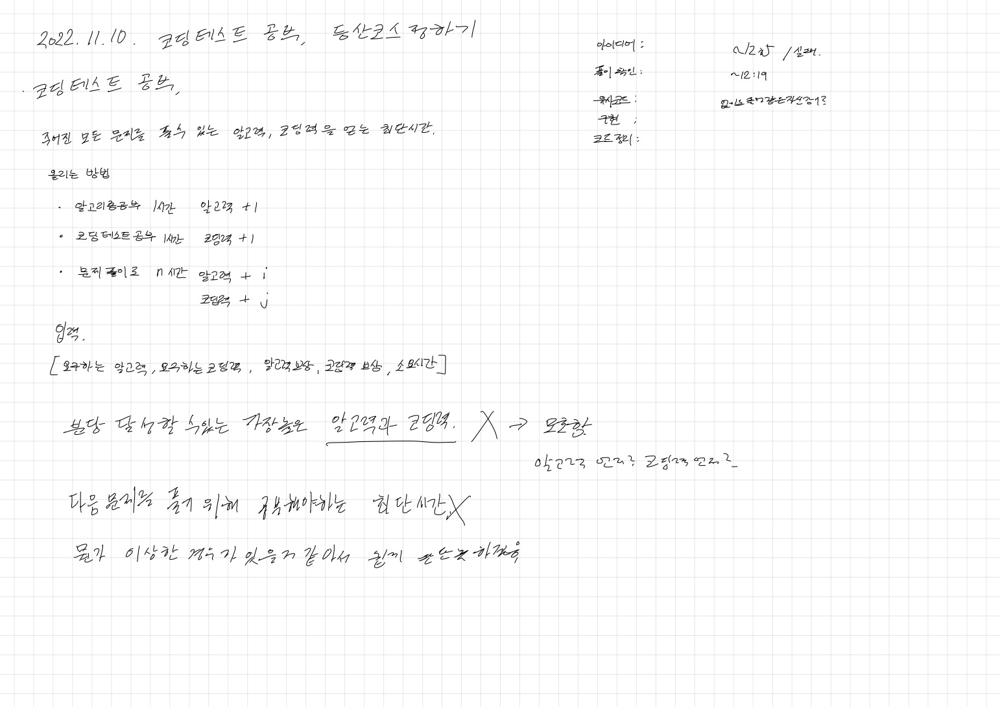
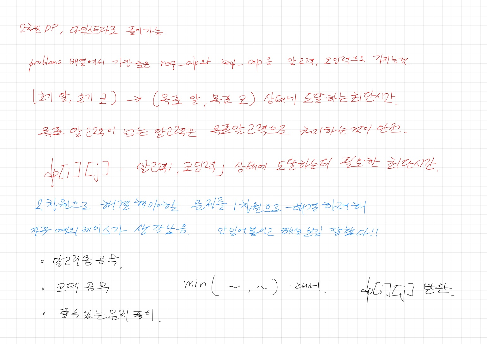
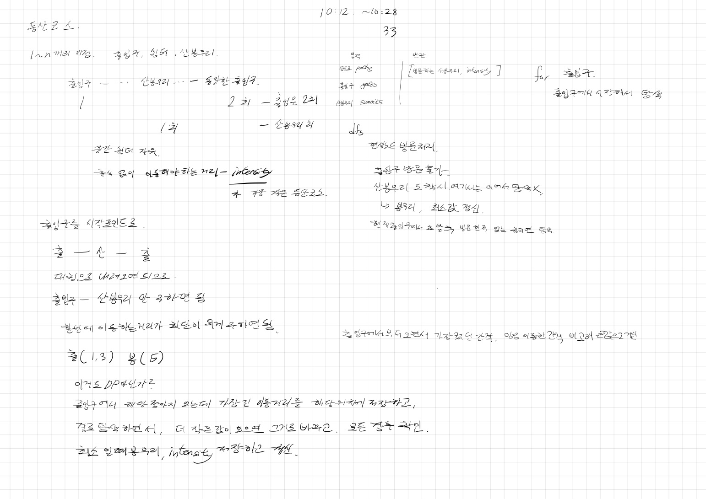

# 2022.11.10.

# 코딩 테스트 연습





[코딩 테스트 연습](https://school.programmers.co.kr/learn/courses/30/lessons/118668)

오전 내내, 오후에 짬짬히 풀었다.

시간이 오래 걸린 이유는

조건을 잘 못 줬는데 전체적인 로직이 잘 못된건가 보고 있었기 때문이다.

AS-IS

```
if (requiredAlgorithmStat <= a && requiredCodingStat <= c) {
```

TO-BE

```
if (requiredAlgorithmStat <= a && c <= requiredCodingStat) {
```

# 등산 코스 정하기



[등산 코스 정하기](https://school.programmers.co.kr/learn/courses/30/lessons/118669)

진짜.. 놔주는게 어려운 것 같다.

좀 만 더 생각하면 풀 것 같은데? 하다보니 또 새벽이다.

머리도 안 돌아가고 멍때리고 있는 시간이 더 긴 것 같다.

이러면 진짜 비효율적이라는거 아는데... 그냥 푹자고 일어나서 답 봐야겠다.

결국 시간 초과, 메모치 초과 제외하고는 다 맞게 만들었다.

