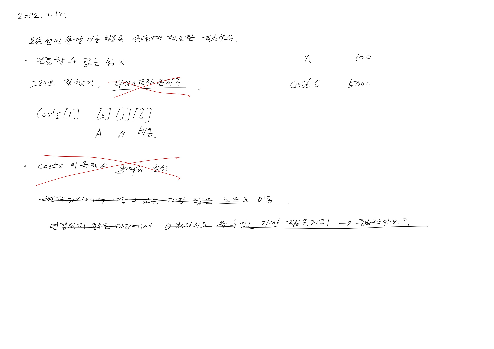
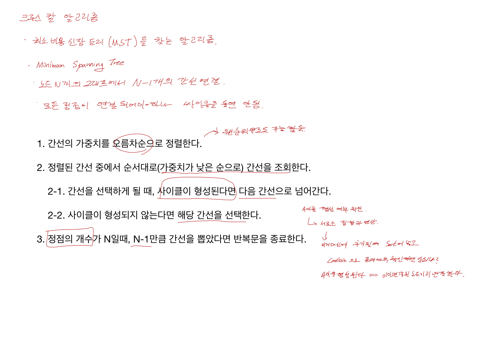
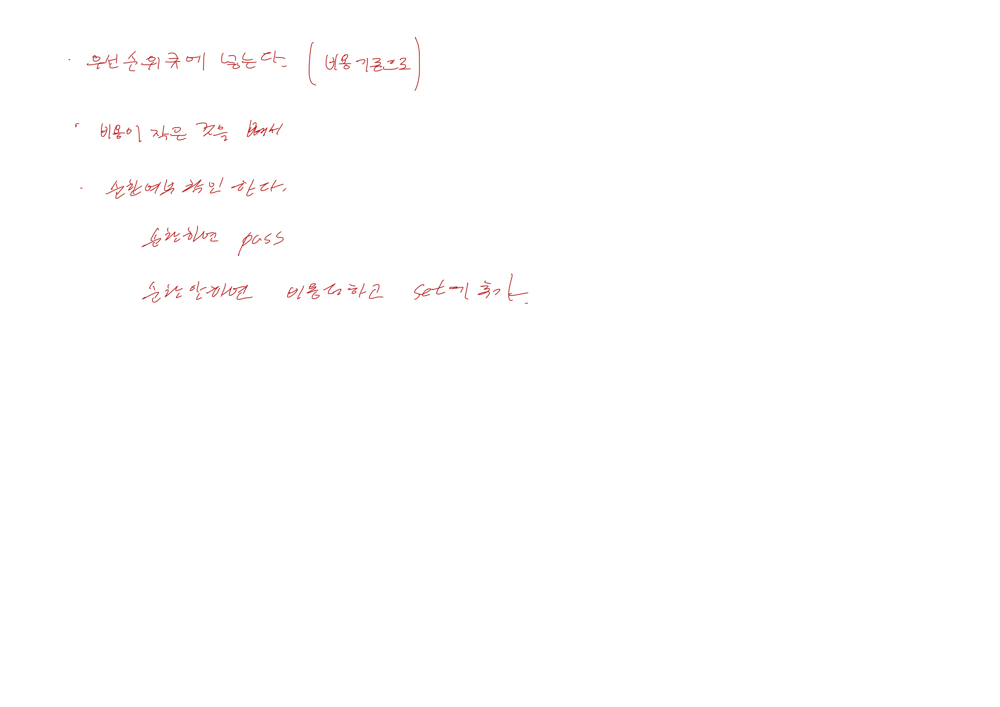
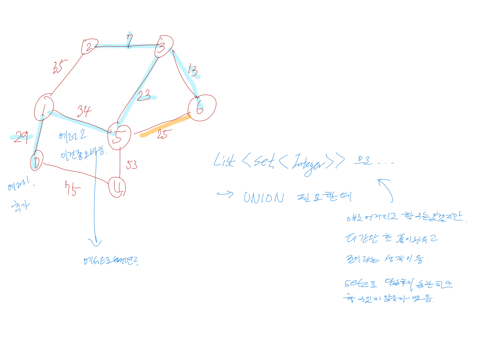
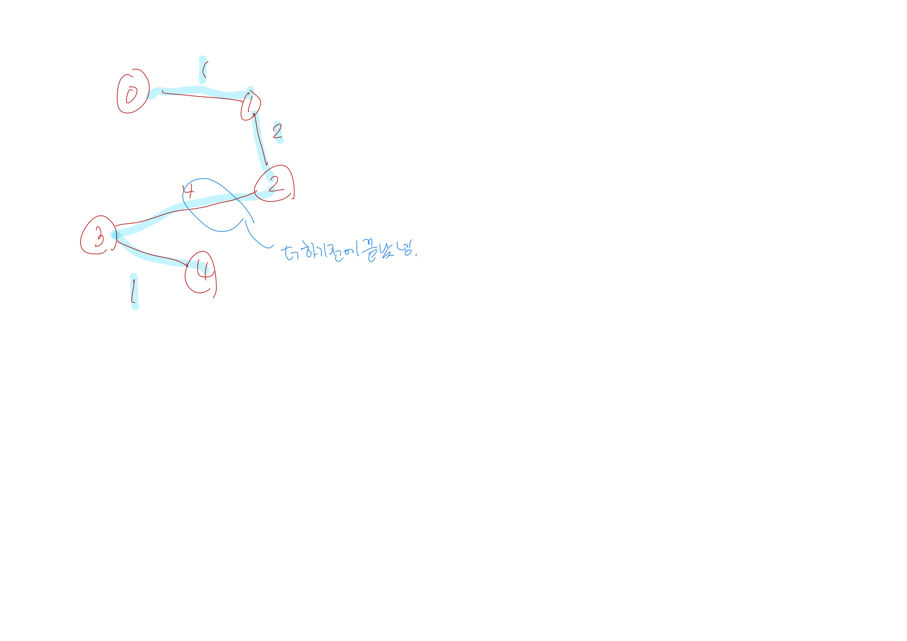

# 2022.11.14.

# 섬 연결 하기

[섬 연결 하기](https://school.programmers.co.kr/learn/courses/30/lessons/42861#)

한 시간만 해야지 하다가 두 시간 반 걸렸다.

20분 풀이를 생각하다가 안 될 것 같아 풀이를 봤다.

그랬는데, 크루스칼 알고리즘이란 걸 알았다.

union find 개념이 왜 필요하지 했었다.

우선순위 큐에 Set 쓰면 그냥 될 것 같은데? 라는 생각에 그냥 구현 해봤다.

구현 후 테스트 케이스를 돌려보며 부분 부분 잘못 된 점을 찾았다.

결국 이 문제들을 해결하기 위해 UNION 과 Find 가 필요했다.

재귀로 구현하면 좀 더 쉽게 할 수 있는데

돌아 돌아 복잡하게 구현한 것 같은 느낌이 든다.

문제를 이해하고 기존에 풀이 보니까 진짜 박수가 쳐졌다.

처음 봤을 때는 이해가 안 됐는데 직접 구현해 보니까 저만한 풀이가 없네.

우선순위 큐, 셋 보다 정렬, 재귀 만으로 이렇게 풀 수 있구나.







## 리팩터링

### 가독성

* AS-IS

```
if (setIndex1 == setIndex2) {
    continue;
}
unionSet(setIndex1, setIndex2);

int setIndex = getSet(now.node1);
connects.get(setIndex).add(now.node1);
connects.get(setI
```

* TO-BE

```
if (setIndex1 != setIndex2) {
    unionSet(setIndex1, setIndex2);
    int setIndex = getSet(now.node1);
    connects.get(setIndex).add(now.node1);
    connects.get(setI
}
```

## 참고할만한 자료

[섬연결하기](https://born2bedeveloper.tistory.com/32)

[크루스칼알고리즘](https://born2bedeveloper.tistory.com/31)

[서로소집합](https://born2bedeveloper.tistory.com/29)