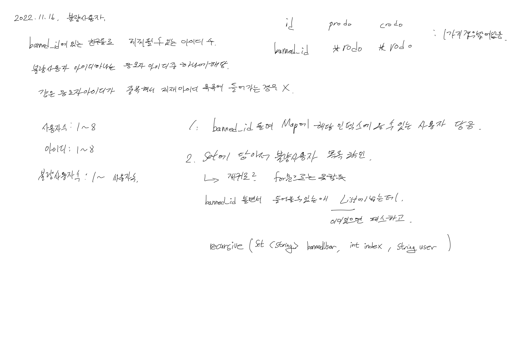

# 2022.11.16.

오늘 힘들었어서 노래 들으면서 쉬면서 풀었는데 이게 맞네

# 불량 사용자

[불량 사용자](https://school.programmers.co.kr/learn/courses/30/lessons/64064)



```
recursive(new HashSet<>(), -1, null);
```

재귀를 살짝 어거지로 구현했다.

다른 분들 코드를 봤는데 비트마스킹? 정규 표현식 사용하시고 푸셨는데

그런거 없이 푼거 치고는 깔끔하게 풀지 않았나? 싶다.

전역 변수로 선언 한 부분이 마음에 걸려, 재귀 함수 파라미터로 받았다.

* As-Is

```
class SolutionFirst extends Solution {
    Set<Set<String>> answer = new HashSet<>();
    Map<String, Set<String>> map = new HashMap<>();
    String[] banned_id;
```

* To-Be

```
recursive(new HashSet<>(), -1, null, banned_id, answer, map);
```

지금 레벨에서는 더 리팩터링 할 부분을 못 찾겠다.