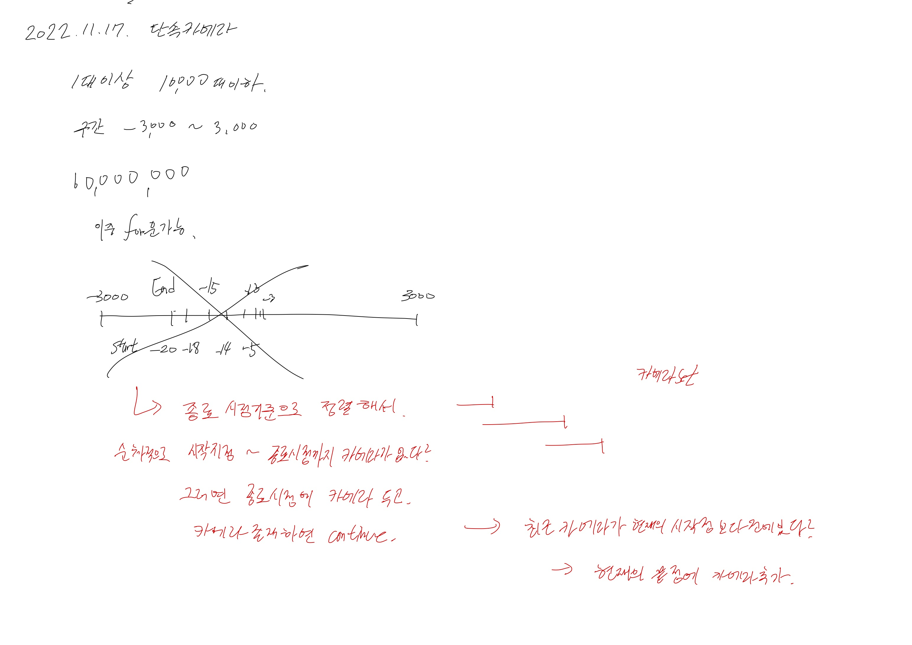

# 2022.11.17.

# 단속 카메라

[단속 카메라](https://school.programmers.co.kr/learn/courses/30/lessons/42884)

아이디어가 생각 안나서,풀이 아이디어를 찾아봤다.

카메라가 설치 되어야 할 부분(끝점)을 기준으로 정렬하고,

정렬한 것을 순차적으로 탐색해서, 현재 route 에 카메라가 없으면 끝 점에 카메라를 설치

처음엔 for 로 시작점 부터 끝점 까지 다 탐색 했지만,

시간 초과가 나서 더 생각해보니, 최근 카메라보다 끝점이 이후일 경우에만 끝점에 카메라를 설치하면 됐다.

