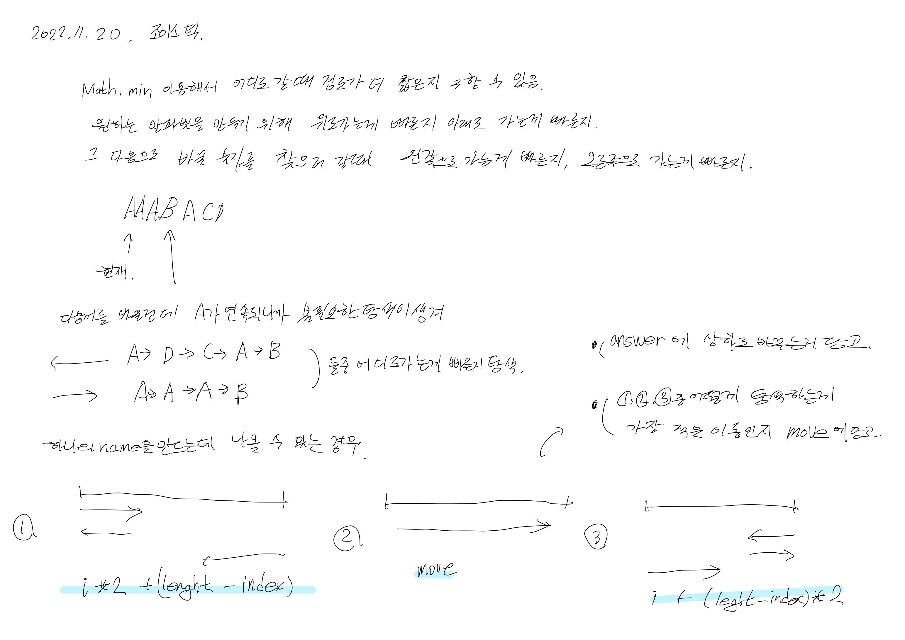
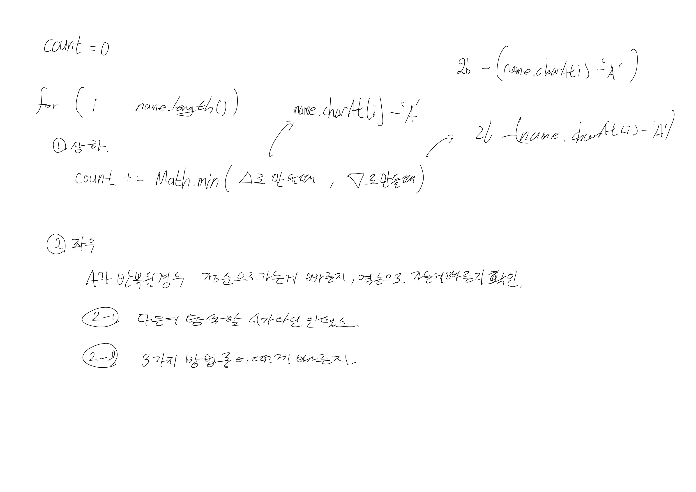

# 2022.11.20.

## 조이 스틱

[조이스틱](https://school.programmers.co.kr/learn/courses/30/lessons/42860#)

처음엔 글을 읽어도 이해가 안됐다.

그러다가 이동할 수 있는 방법이 몇 종류로 나오는지 나눠 보자.

하고 문제에서 for 문에 Math.min으로 좌우 이동 경로를 구하는 것이 이해가 됐다.

제대로 필기하고, 이해하고 나니 구현은 쉽게 됐다.

### 참고 자료

* https://excited-hyun.tistory.com/207