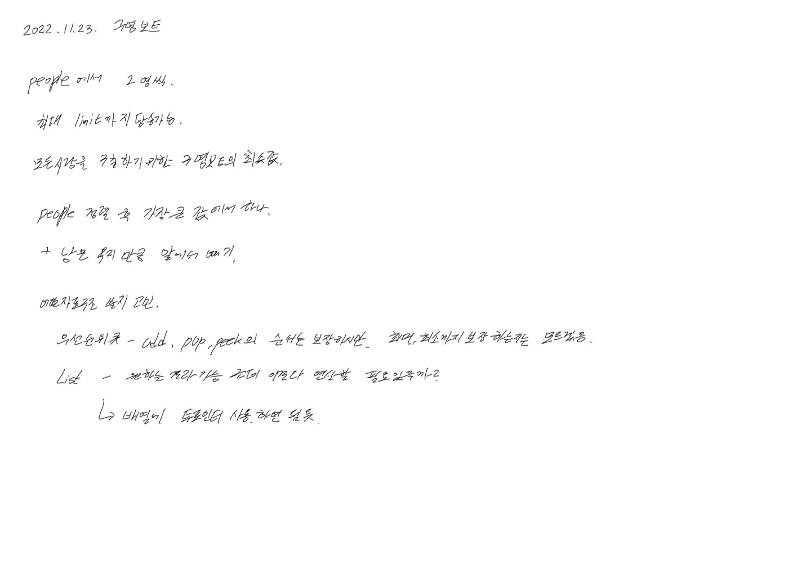

# 2022.11.23.

# 구명보트

[구명보트](https://school.programmers.co.kr/learn/courses/30/lessons/42885)



## 2명 태우는 로직

* AS-IS

```
int extraWeight = limit - people[right--];
while (extraWeight >= people[left]) {
    extraWeight -= people[left];
    left++;
}
```

남는 무게 만큼 사람을 태우자는 생각으로 이렇게 구현했고, 정답이었지만,

최대 2명 태울 수 있다는 제약조건을 보고 아래 처럼 수정 했다.

* TO-BE

```
if (people[left] + people[right--] <= limit){
    left ++;
}
```

## Stream collect

배열로, 리스트 어떻게 만들었더라... of? asList?

이런 식으로 쓰면 쓸 수록 왜 스트림을 만들었는지 알것 같다.

stream 의 collect 를 사용하는데 Collectors.toList() 가 안됐다.

왜 안되지 했는데 기본형이어서 안됐다.

boxed() 로 중간 연산 한번 하니 제대로 됐다.

```
// Primitive Type Array -> Wrapper Type List
List<Integer> list = Arrays.stream(people).boxed().collect(Collectors.toList());

// Wrapper Type List -> Primitive Type Array
int[] array = list.stream().mapToInt(Integer::valueOf).toArray();
```
ㅎ