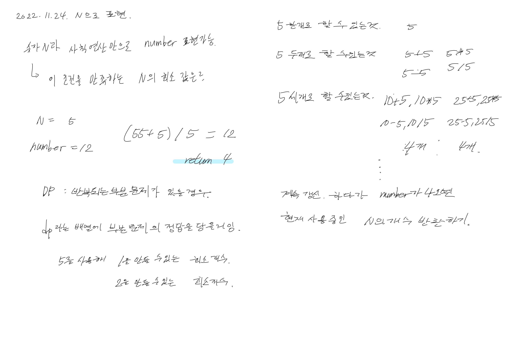

# 2022.11.24.

Spring Rest Docs 프로젝트에 적용해 보려고 삽질 하다가,

적용은 못 했지만, TIL 하려고 부랴부랴 마무리 짓고 왔다.

역시 일과 시작 전에 해야돼.

# N 으로 표현

[N으로 표현](https://school.programmers.co.kr/learn/courses/30/lessons/42895)

어떻게 풀지 아이디어는 정리해뒀다.

일단 커밋 후 구현하고 자야겠다

-> 금방 풀 줄 알았으나.

더 공부하고 풀어야 할 듯

https://datacodingschool.tistory.com/212
