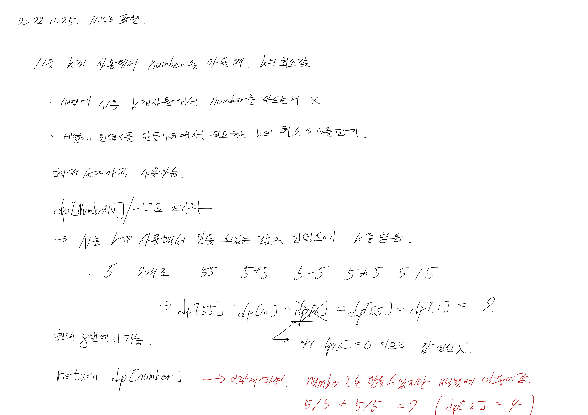

# 2022.11.25.

# N 으로 표현

[N으로 표현](https://school.programmers.co.kr/learn/courses/30/lessons/42895)



테스트 케이스는 통과 했고 일부 실패 하는데 거의 다 푼거 같은데 쉽지 않네....

일단 일이 있어서 여기까지 하고 다음에 이어서 풀어봐야겠다.

```
dp[0] = 0;
sets.add(new HashSet<>(List.of(0)));
dp[N] = 1;
sets.add(new HashSet<>(List.of(N)));
for (int i = 2; i < 9; i++) {
    sets.add(new HashSet<>());
    for (int prevNumber : sets.get(i - 1)) {
        addDp(i, prevNumber + N);
        addDp(i, prevNumber - N);
        addDp(i, prevNumber / N);
        addDp(i, prevNumber * N);
        addDp(i, prevNumber * 10 + N);
    }
}
```

현재 코드에서 문제점

(5 + 5 / 5 ) + 5 는 되는데

(5 + 5) / (5 + 5) 와 같은 경우는 고려 안됨

어떻게 하면 될까?

sets 에서 꺼내서

현재 사용할 수 있는 개수가 4 개면

sets[1] 과 sets[3]

sets[2] 와 sets[2]

이렇게 안에 있는 인자끼리 더하면 되지 않을까?

오 테케 두개 빼고 맞음

```
for (int i = 2; i < 9; i++) {
    sets.add(new HashSet<>());
    for (int j = 0; j < i; j++) {
        for (int number1 : sets.get(j)) {
            for (int number2 : sets.get(i - j)) {
                addDp(i, number1 + number2);
                addDp(i, number1 - number2);
                addDp(i, number1 / number2);
                addDp(i, number1 * number2);
                addDp(i, number1 * (int) Math.pow(10, String.valueOf(number2).length()) + number2);
            }
        }
    }
}
```

질문하기에 숫자를 더하는 경우는 N 만 더할 수 있다는거 보고 조건 추가해 주니 성공!

```
for (int i = 2; i < 9; i++) {
    sets.add(new HashSet<>());
    for (int j = 0; j < i; j++) {
        for (int number1 : sets.get(j)) {
            for (int number2 : sets.get(i - j)) {
                addDp(i, number1 + number2);
                addDp(i, number1 - number2);
                addDp(i, number1 / number2);
                addDp(i, number1 * number2);
                if (j == 1) {
                    addDp(i, number1 * (int) Math.pow(10, String.valueOf(number2).length()) + number2);
                }
            }
        }
    }
}
```

for 문 4 depth.... 살짝 걸리자만, 이거 말고 방법이 있나?

dfs 로 푼거는 depth 낮은대신 시간, 메모리 복잡도 더 높았음.

일단 이게 최선이라고 생각하기

결국 풀어서 기분 좋다!
