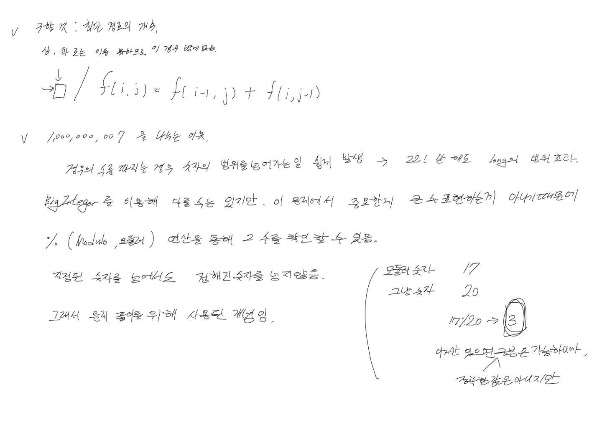

# 2022.11.27.

# 등굣길

[등굣길](https://school.programmers.co.kr/learn/courses/30/lessons/42898#)




처음에 문제를 잘 못 보고, 가장 짧은 경로를 찾았다.

억지로 문제를 끼워 맞춰서, 테스트 케이스 통과 시키고, 제출한게 다 틀려서 문제를 다시 보니

내가 문제를 잘 못 이해한거였다.

문제 잘 못 이해하고 아 이 소린가? 하고 억지로 끼워 맞춘것이 참 웃기다.

문제를 제대로 이해하자아아

문제 자체는 어렵진 않았고, set 특징, 1,000,000,007 나누는 이유, 코드에서 천의 자리 구분에 대해 공부 했다.

## Set 특징

Set 에서 같은 값인지 판단하는 것은 equals 를 이용한다.

```
Set<int[]> set = new HashSet<>();
set.add(new int[]{1, 2});
boolean contains = set.contains(new int[]{1, 2}); // false
set.add(new int[]{1, 2});
set.size() // 2
```

Node 에 equals, hashcode 구현 안 한 경우

```
Set<Node> set = new HashSet<>();
set.add(new Node(1, 2));
boolean contains = set.contains(new Node(1, 2)); // false
set.add(new Node(1, 2));
set.size() // 2
```

Node 에 equals, hashcode 구현한 경우

```
Set<Node> set = new HashSet<>();
set.add(new Node(1, 2));
boolean contains = set.contains(new Node(1, 2)); // true
set.add(new Node(1, 2));
set.size() // 1
```

## 자바에서 천의 자리 구분

1,000,000,007 을 100000007 로 표현하면 자리 수 헷 갈리니,

```
1_000_000_007
```

이렇게 표현 가능하다

이런게 있다는 것은 알고 있었는데 뭔지 기억이 안났다.

검색해도 다 결과 출력시라,

키보드에 있는 기호 하나씩 다 해봤다.

## 1,000,000,007 나누는 이유

큰 수를 범위 내의 수로 표시하기 위해서.

이 문제에서 중요한 것은 큰 수를 다루는 방법이 아니기 때문에,

해당 수로 나누어, 값을 구분

참고 자료

* https://www.facebook.com/algoguide/posts/1117664551755294/

* https://developer-eun-diary.tistory.com/19