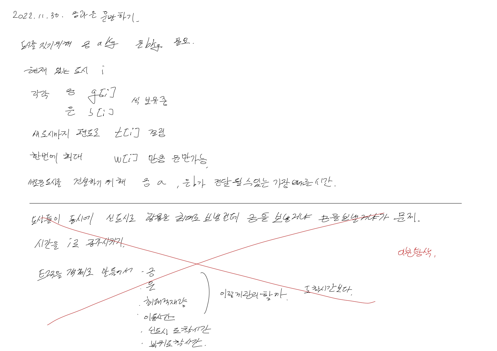

# 2022.11.30.

# 금과 은 운반하기

[금과 은 운반하기](https://school.programmers.co.kr/learn/courses/30/lessons/86053)

문제 풀다가 풀이 법이 생각 안나서, 정답을 찾아 봤다.

정답을 찾아 봐도 지금 내가 풀 수 있는 문제는 아닌것 같다는 생각이 들어.

코드를 따라 옮겨 보며 풀이법 정도만 이해 했다.

https://bellog.tistory.com/m/188

위의 블로그가 가장 이해하기 쉬웠다.

다 이해는 못 했지만, 너무 많은 시간이 들어가 지금은 여기 까지만 하고 다른 할 거 해야 겠다.