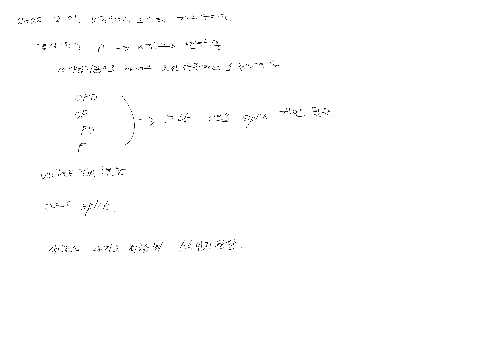

# 2022.12.01.

## k 진수에서 소수의 개수 구하기

[k 진수에서 소수의 개수 구하기](https://school.programmers.co.kr/learn/courses/30/lessons/92335)



자꾸 이상한 곳에서 안되네... 일단 계속 풀어보자

왜 안됐던거지?

메서드로 뽑았더니 그냥 됐다.

왜 그런지는 잘 모르겠으나, 다른 할게 남아 있어 일단 넘어가고 다음에 봐야겠다.

AS-IS

```
for (long data : datas) {
    if(data <= 1){
        continue;
    }
    if (data == 2) {
        count++;
        continue;
    }
    long length = (long)Math.sqrt(data)-1;
    for (long i = 2; i <= length; i++) {
        if (data % i == 0) {
            break;
        }
        if (i == length) {
            count++;
        }
    }
}
```

TO-BE

```
private boolean isPrimeNumber(long data) {
    if (data <= 1)
        return false;
    if (data == 2)
        return true;
    long length = (long) Math.sqrt(data) + 1;
    for (long i = 2; i < length; i++) {
        if (data % i == 0) {
            return false;
        }
    }
    return true;
}
```