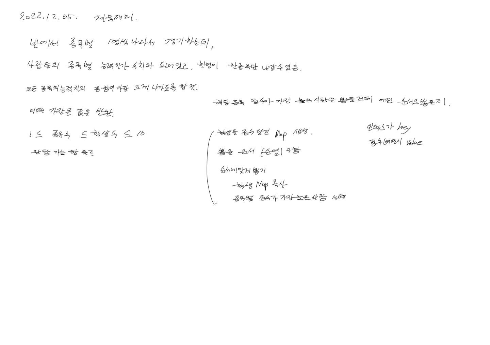
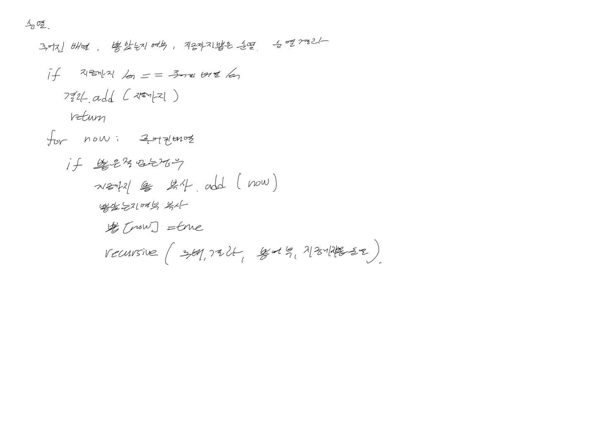

# 2022.12.05.

## 체육대회

[체육대회](https://school.programmers.co.kr/learn/courses/15008/lessons/121684)





풀었지만, 너무 오래 걸렸고, 풀고나니 불필요한 부분이 많이 보였다.

순열을 오랜만에 구현하려 하니 살짝 막막했지만,

어떤 기능이 필요한지 정리하면서 구현하니까 금방 구현했음

고민할 시간에 정리하고 구현하기.

### 문제 풀이 프레임워크

```
문제 제대로 이해 (나만의 언어로 정리)

문제를 어떻게 해결할지 방법 고민

어떻게 코드로 작성할지 정리

코드 작성
```

이게 돌아가지 않는 방법인 것 같다.
