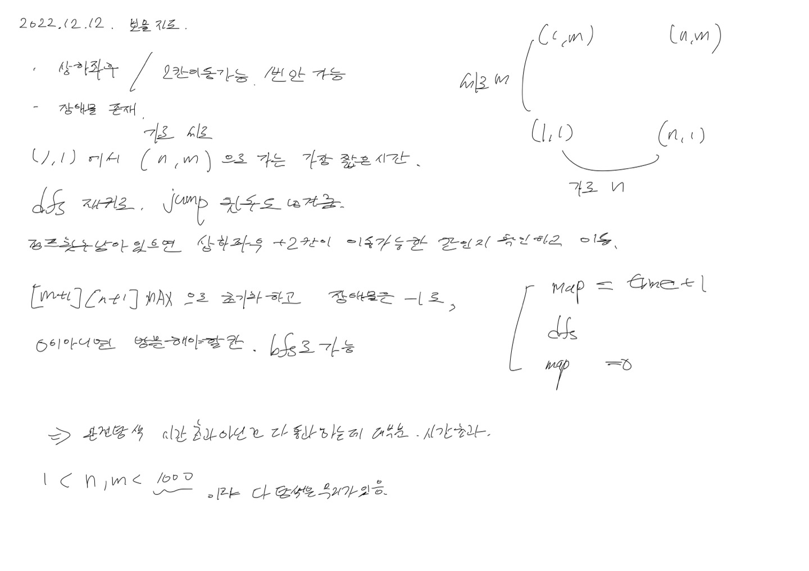

# 2022.12.12.

# 보물 지도

[보물 지도](https://school.programmers.co.kr/learn/courses/15009/lessons/121690)

아이디어는 생각했고, 구현 중

시간 초과

완전 탐색으로 풀기에는 무리가 있는 듯

아이템을 쓴 경우, 안 쓴 경우 이렇게 두가지 맵 가지고 해당 점까지의 최단 거리를 구할 수 있나?