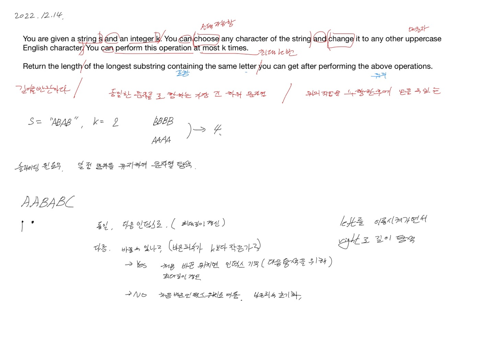
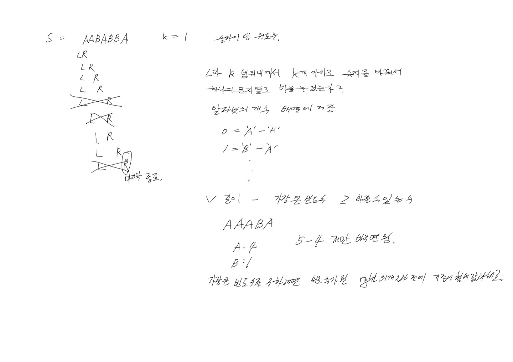

# 2022.12.14.

이제 취업 했으니, TIL 로 코테 문제 푸는 것은 그만하고 기술에 집중해야되나?

아니면 영어 공부할 겸 계속 LeetCode 풀어야 되나 고민 중이다.

# 424. Longest Repeating Character Replacement

[424. Longest Repeating Character Replacement](https://leetcode.com/problems/longest-repeating-character-replacement/description/)

처음엔 슬라이딩 윈도우 인듯 아닌 듯 하게,

틀린 테스트 케이스를 보고 수정해 가며 풀었다.

결국 BBAAAAAA 에서 막혔다.

구현한 코드로는 AAABB 는 풀 수 있는데 BBAAAA 처럼 앞의 뒤의 값으로 바꿔야 할 경우를 구현 못했다.

아이디어를 봤다. 이래서 슬라이딩 윈도우라고 하는구나를 딱 느꼈다.