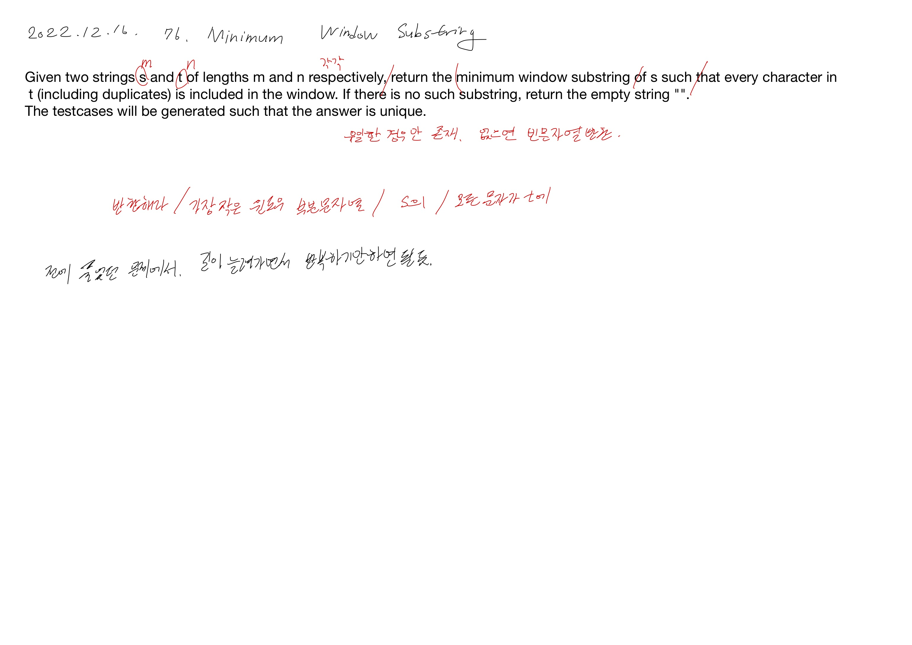

# 2022.12.16.

# 76. Minimum Window Substring

[76. Minimum Window Substring](https://leetcode.com/problems/minimum-window-substring/description/)

어제 푼 문제를 응용해서 쉽게 풀 수 있었는데, 영어 해석이 잘 안 됐다.

공식 문서 읽고 하려면 이거도 꾸준히 해봐야지 싶다.