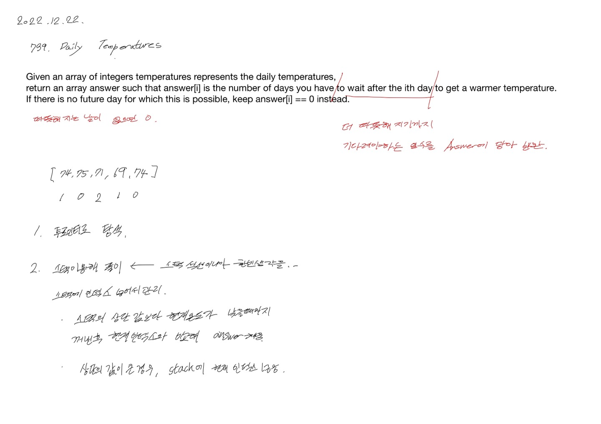

# 2022.12.22.

# 739. Daily Temperatures

[739. Daily Temperatures](https://leetcode.com/problems/daily-temperatures/description/)

현재 보다 더 따뜻한 날이 며칠뒤인지 구하는 문제

처음으로는 투 포인터를 이용해서 모든 경우를 탐색해보는 방법이 떠올랐는데,

스택 카테고리의 문제로 어떻게 스택을 이용해서 풀어볼까 고민했다.

인덱스를 스택에 넣고 스택의 상단의 값과 현재 온도를 비교해,

현재의 온도가 스택의 상단의 온도 보다 따뜻한 경우,

스택에서 꺼내서 answer 배열에 며칠 차이 인지 넣어 주면 된다.
