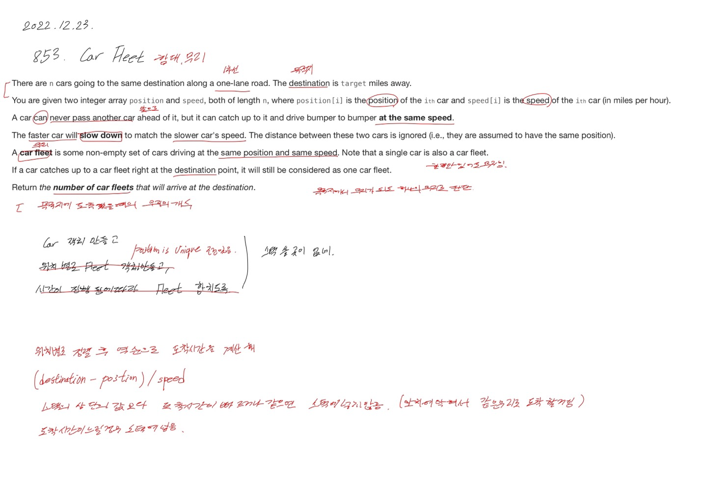

# 2022.12.23.

## 853. Car Fleet

[853. Car Fleet](https://leetcode.com/problems/car-fleet/)

시간을 기준으로 무리를 만들어서 탐색하면 풀릴 것 같았으나,

스택으로 푸는 방법이 생각나지않아 닛코드 풀이를 봤다.

위치를 기준으로 정렬하고, 역순으로 탐색하면서

남은 거리를 혼자 달릴 경우 도착 예정시간을 계산해서

앞차가 빠르거 같으면 스택에 넣지 않고,

앞차 보다 느릴 경우 스택에 넣어 들어 오는 무리를 만들었다.

아이디어가 좋네...

지금 릿코드 제출이 안되서 일단 테스크 케이스만 다 해보고 커밋한다.
