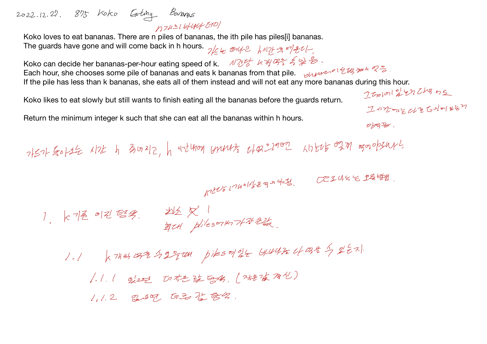

# 2022.12.27.

# 875. Koko Eating Bananas

[875. Koko Eating Bananas](https://leetcode.com/problems/koko-eating-bananas/description/)



문제가 이해 하는데 시간이 좀 걸렸다.

가드가 더미 하나씩 왔다 갔다 하는데 그 사이에 몰래 먹는건가...

가드가 오는 시간 h, 코코가 시간당 먹을 수 있는 바나나의 수 k 가 혼동 되어 그랬다.

시간당 먹는 바나나의 최소 값을 구하는 문제니까 이걸 기준으로 이분 탐색해 최소 값을 찾으면 되겠다. 라는 개념 잡고는 금방 구현했다.

### 이분 탐색 조건

* As-Is

```
    ...
    if (isEatable(piles, h, mid)) {
    ...

public boolean isEatable(int[] piles, int h, int k) {
    piles 탐색하며 eatTime 구하는 코드
    return eatTime <= h;
}

```

* To-Be

```
    ...
    int hourSpent = 0;
    ... piles 탐색하며 hourSpent 구하는 코드
    if (hourSpent <= h) {
    ...
```

시간내에 먹을 수 있는지를 판단하는 메서드를 만들어서 이분 탐색을 진행했다.

먹는데 걸리는 시간을 구하고 비교하는 것이 뭔가 더 지금까지 내가 푼 이분 탐색스럽다는 느낌이 들었다.

### 최소값 찾기

* As-Is

```
    ...
    right = mid;
    minK = mid;
    ...

return minK;
```

* To-Be

```
    ...
    right = mid;
    ...

return right;
```

최소 값을 구하기 위해 조건을 만족하는 경우 가장 작은 값을 갱신했다.

근데 다른 분의 코드를 보고 다시 생각해 보니,

같은 연산을 그냥 두번 하고 있었다는 것을 알게 되었다.

### 먹는데 걸리는 시간

```
hourSpent += Math.ceil((double) pile / middle);
```

```
if (pile % k == 0) {
    eatTime += pile / k;
} else {
    eatTime += (pile / k + 1);
}
```

위의 코드를 보고 이렇게 간단하게도 구할 수 있구나 했는데, 직접 돌려보니 더 무거웠다.

그래서 살짝 더 길지만 빠른 아래 코드로 최종 결정했다.