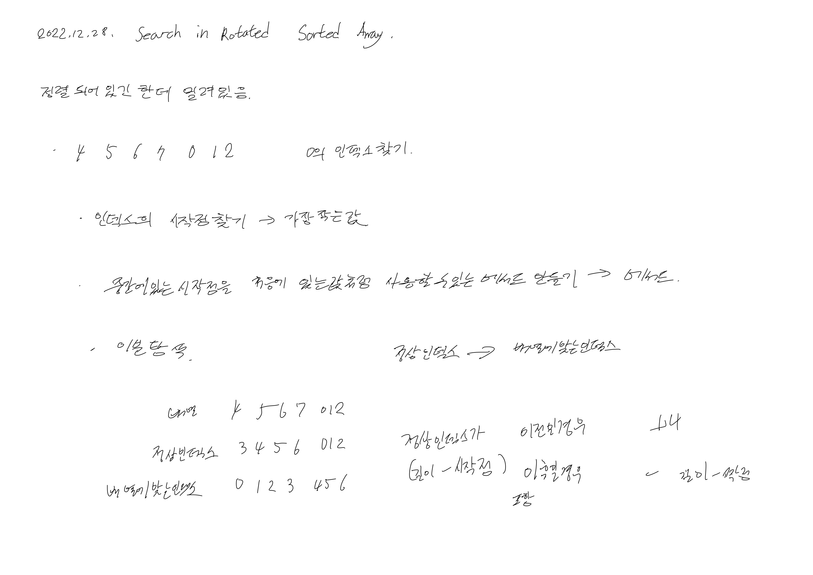
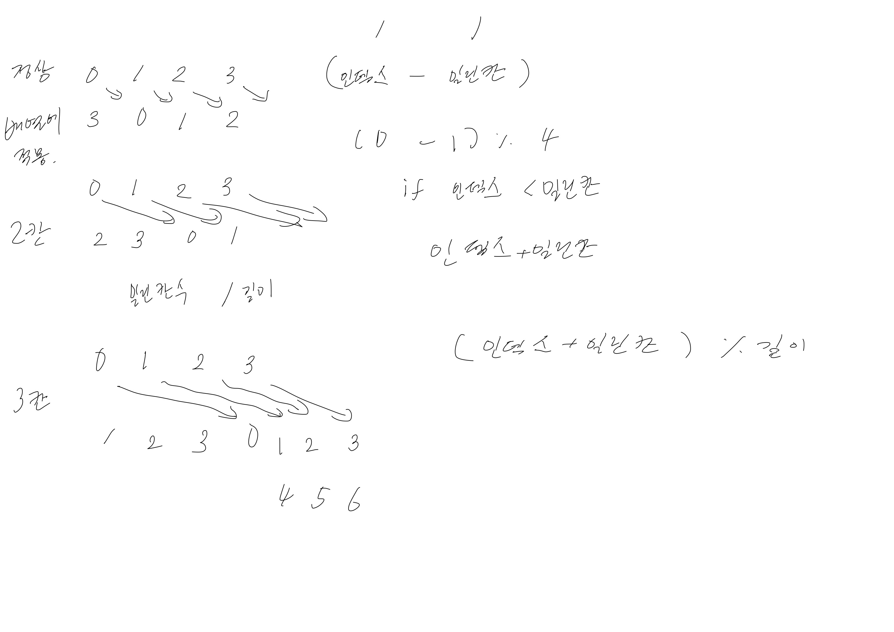

# 2022.12.28.

# 33. Search in Rotated Sorted Array

[33. Search in Rotated Sorted Array](https://leetcode.com/problems/search-in-rotated-sorted-array/description/)

풀이 아이디어는 금방 떠올렸지만, 구현에 오래 결렸다.

이진 탐색 구현이 아니라, 밀린 인덱스를 바꾸는 처리를 하는 부분에서 오래 잡혀있었다.

이렇게 짜면, 내가 원하는 기능대로 되겠지? 하고 다음 기능으로 넘어가고 넘어가고,

하다보니 어느 순간 이상한 부분을 잘 못 된 방법으로 수정하고 있었다.

왜 테스트가 중요한지를 몸소 느끼고 있다.

정상 인덱스를 현재 배열으로 밀어주는 기능을 하는 pivot 메서드를 제대로 테스트 하며 디버깅 하니 통과 했다.

그리고 내가 지금 필요한 것, 하려고 하는 것이 무엇인지 확실하게 정의하고,

이 입력 값을 넣으면 어떤 출력이 나와야하는지를

생각해 두고 정리해 둔 상태에서 디버깅을 하면 더 빨리 할 수 있겠다는 생각이 들었다.
