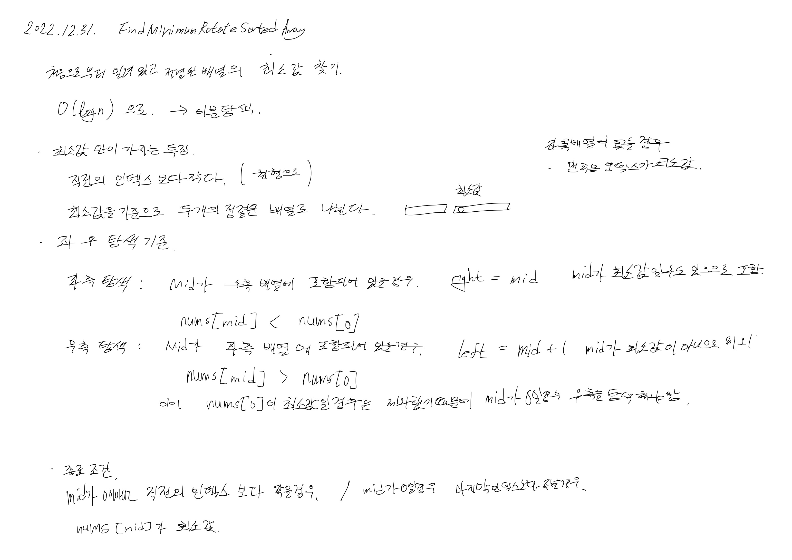

# 2022.12.31.

# 153. Find Minimum in Rotated Sorted Array

[153. Find Minimum in Rotated Sorted Array]https://leetcode.com/problems/find-minimum-in-rotated-sorted-array/



꼼꼼하게 생각하면서 상황을 분석했다.

```
left 와 rigth 를 선언

두 개의 배열로 나뉘지 않는 경우 맨 처음의 값이 최소값

left 와 rigth 의 순서가 뒤집히지 않을때까지 반복
    mid 선언

    mid 가 최소값일 경우 nums[mid] 반환
        
    nums[mid] 가 최소값이 있는 우측 배열에 포함되어 있을 경우
        좌측 탐색
    
    nums[mid[ 가 최소 값이 없는 좌측 배열에 포함되어 있을 경우
        우측 탐색
        
여기까지 왔다면 잘 못 되었으므로 이를 표시하기 위한 -1 반환
```

억지로 끼워 맞춘 듯한 느낌이 들기도 하지만, 일단 지금은 이렇게 해야 이해가 된다.